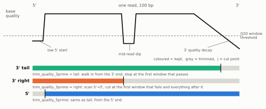

# Read preprocessing — what happens to reads before alignment

Everything between the samplesheet and bwa-mem, in run order. **By default nothing here runs**: reads
are aligned exactly as sequenced (FastQC still reports on them). Each step is its own switch; fastp
runs only when step 1 or 2 is on (or `split_fastq > 0`). Parameter group in the launch form /
`--help`: **Read preprocessing**.

```
raw FASTQ → FastQC (report only)
          → step 0  UMI consensus            fgbio      only with --umi_read_structure
          → fastp:  step 1  adapter trimming             --trim_adapter
                    step 2  quality trimming per end     --trim_quality_3prime / --trim_quality_5prime
                    step 3  read filtering               --filter_quality (on), --length_required
          → bwa-mem
```

Recommended recipe for ALE data (not the default — see [Defaults](#defaults-and-the-baseline)):

```
--trim_adapter --trim_quality_3prime tail
```

## Step 0 — UMI consensus (fgbio)

Only when `--umi_read_structure` is given: reads carrying unique molecular identifiers are grouped
(`--group_by_umi_strategy`) and collapsed into consensus reads, which then continue into fastp. This
step is independent of the fastp steps below. **No ALE library uses UMIs**, so both parameters are
hidden in the launch form (still accepted from a params file).

## Step 1 — Adapter trimming

`--trim_adapter` runs fastp adapter removal. No adapter sequence is required: paired reads are trimmed
wherever the two mates overlap, and fastp infers the adapter sequence from the data for pairs that do
not overlap (`--detect_adapter_for_pe`). On the ottilie test set that found Nextera adapter in 11 % of
the evolved clone's reads and trimmed 10 Mb of sequence that bwa would otherwise soft-clip.

| Parameter | Default | Use |
|---|---|---|
| `trim_adapter` | off | the switch. `trim_fastq` (upstream sarek's name) is a deprecated alias with the same behaviour. |
| `adapter_sequence`, `adapter_sequence_r2` | auto | name the kit's adapter explicitly when fastp reports `unspecified` (low-adapter libraries): Nextera `CTGTCTCTTATACACATCT`, TruSeq R1 `AGATCGGAAGAGCACACGTCTGAACTCCAGTCA` / R2 `AGATCGGAAGAGCGTCGTGTAGGGAAAGAGTGT`. |
| `trim_nextseq` | 0 | any non-zero value forces poly-G tail trimming (two-colour NextSeq/NovaSeq chemistry). At 0 fastp decides by itself from the read names, as in upstream sarek: on when the first read name has a NextSeq/NovaSeq prefix (`@A00123:…`), off otherwise — so SRA-renamed data (`@SRR…`) is only trimmed if you set this. |

Step 1 behaves as upstream sarek's `--trim_fastq`: fastp's read-level quality filter (step 3) is on
unless you turn it off.

## Step 2 — Quality trimming, per read end

Trims a **variable** number of low-quality bases from a read end — there is no fixed base count. fastp
slides a window (`trim_quality_window`, default 4 bases) and trims where the window's mean quality is
below `trim_quality_mean` (default Q20).

| Parameter | Default | Use |
|---|---|---|
| `trim_quality_3prime` | off | `tail`: walk in from the 3′ end, stop at the first window that passes (Trimmomatic `TRAILING`). `right`: scan 5′→3′, cut at the first window that fails and everything after it (Trimmomatic `SLIDINGWINDOW`). |
| `trim_quality_5prime` | off | same as `tail` from the 5′ end (fastp `--cut_front`, Trimmomatic `LEADING`); fastp has no second 5′ method. Combinable with the 3′ mode. |
| `trim_quality_mean`, `trim_quality_window` | 20, 4 | shared by both ends. Window 1 makes it per-base. |

<details>
<summary><b>Schematic: what each mode keeps</b> (click to expand)</summary>



`tail` removes only the 3′ decay; `right` cuts at the first dip and loses everything after it; the 5′
mode removes only a low start. Source: `docs/dev-practices/figures/fastq_trimming/make_schematic.py`.

</details>

Which 3′ mode: `tail` is the gentle choice and matches Illumina's 3′ quality decay. On the ottilie
test set it removed 0.03 % (evolved clone) to 2.2 % (parent) of bases beyond the adapters. `right` is
3–4 × more aggressive because a single mid-read dip discards the rest of the read — the parent sample
has a systematic dip at position 58 that truncates 10 % of its reads under `right`. Measurements:
[`fastq_preprocessing_audit.md` §2.4](../dev-practices/fastq_preprocessing_audit.md#24-what-each-option-does-to-the-ottilie-test-set).

*Fixed-count alternative (upstream):* `clip_r1`, `clip_r2`, `three_prime_clip_r1`, `three_prime_clip_r2`
remove a set number of bases from each end regardless of quality. fastp applies them **before** the
quality cut, so the two compose: clip the cycles you know are bad, then let the quality cut adapt per
read. Not part of the schematic; use them only when you know the exact number of bases to drop (e.g. a
known bad last cycle).

## Step 3 — Read filtering

Evaluated on the read **after** steps 1–2. A pair is discarded when either mate fails.

| Parameter | Default | Use |
|---|---|---|
| `filter_quality` | **on** | fastp's read-level quality filter: discard a read when more than `filter_quality_percent` (40) of its bases are below `filter_quality_phred` (Q15), or it has more than 5 N. On by default whenever fastp runs, exactly as in upstream sarek. `--filter_quality false` keeps every read (trimming only). |
| `filter_quality_phred`, `filter_quality_percent` | 15, 40 | the two thresholds (fastp `-q`, `-u`). |
| `length_required` | 15 | discard reads shorter than this after trimming (fastp `-l`). Always applied when fastp runs. |

On the ottilie test set the quality filter removes 0.7 % (evolved clone) to 4.2 % (parent) of pairs.
The per-sample counts are in `reports/fastp/<sample>/*.fastp.json` under `filtering_result`, and in
the MultiQC fastp section.

## Not preprocessing steps

- **Parallelisation** — `split_fastq` (main options group, hidden; every ALE profile sets 0) shards
  FASTQs through the same fastp process. A non-zero value runs fastp even with steps 1–2 off; step 3's
  filter then still applies unless `--filter_quality false`.
- **Outputs** — `save_trimmed` publishes the trimmed FASTQs under `preprocessing/fastp/<sample>/`;
  `save_split_fastqs` (hidden) the shards.

## Defaults and the baseline

All steps default to off (step 3 is on only when fastp runs). The verified Azure Batch baseline and the
e2e snapshot were produced with no preprocessing at all, so switching any step on changes the reads
reaching bwa-mem and invalidates byte-comparison against them. Making the recommended recipe the ALE
default is a separate decision tied to the next deliberate baseline re-cut. Validation of the recipe on
the ottilie truth set (4 SNVs + chr I duplication recovered identically):
[`fastq_preprocessing_audit.md` §2.6](../dev-practices/fastq_preprocessing_audit.md#26-validation-performed-2026-09-02).
